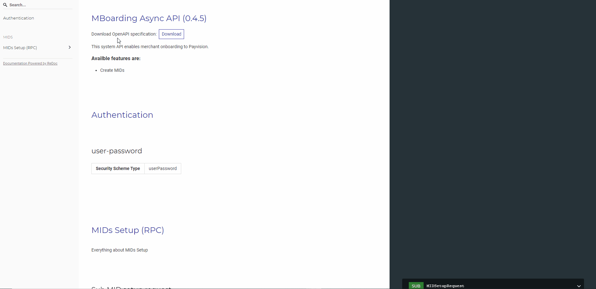

<div align="center">
  

  **OpenAPI/Swagger/AsyncAPI-generated API Reference Documentation**
</div>

**This is README for an ReDoc extension which supports AsyncAPI**
- This project is a fork of [ReDoc documentation](https://github.com/Redocly/redoc).

## Live demo



## Features
- OpenAPI support.
- Basic support for AsyncAPI pub/sub operations.
  - Paremetres, Protocol and Properties for Async API channels.
- It supports `discriminator` feature for both, Open and Async API.
- The following protocols can be used: AMQP
- Availabilty to collapse 

## Roadmap
  - [ ] Header/Traits
  - [ ] Generate Postman collection
  - [ ] Try-it out for Open API
    - https://github.com/swagger-api/swagger-ui/blob/0a807d6237f59880d34131f66cd4fc542fdaca09/src/core/plugins/spec/actions.js
    - https://github.com/swagger-api/swagger-ui/blob/aee8cc5a177327203fb5d5fa91ef1c5cd5df4d30/src/core/components/responses.jsx
    - Schema
      - application/json
      - application/xml
      - multipart/form-data
      - application/x-www-form-urlencoded
  - [ ] Other protocols: http, ws, kafka, ...

## Releases

## Version Guidance
| Aync ReDoc Release | OpenAPI Specification | AsyncAPI Specification |
|:-------------------|:----------------------|:-----------------------|
| 0.0.7              | 3.0, 2.0              | 2.0                    |


## Deployment

### TL;DR

```html
<!DOCTYPE html>
<html lang="en">
  <head>
    <title>ReDoc</title>
    <!-- needed for adaptive design -->
    <meta charset="utf-8"/>
    <meta name="viewport" content="width=device-width, initial-scale=1">
    <link href="https://fonts.googleapis.com/css?family=Montserrat:300,400,700|Roboto:300,400,700" rel="stylesheet">

    <!--
    ReDoc doesn't change outer page styles
    -->
    <style>
      body {
        margin: 0;
        padding: 0;
      }
    </style>
  </head>
  <body>
    <redoc spec-url='http://petstore.swagger.io/v2/swagger.json'></redoc>
    <script src="https://cdn.jsdelivr.net/npm/redoc-asyncapi/bundles/redoc.standalone.js"> </script>
  </body>
</html>
```
That's all folks!

**IMPORTANT NOTE:** if you work with untrusted user spec, use `untrusted-spec` [option](#redoc-options-object) to prevent XSS security risks.

### 1. Install ReDoc (skip this step for CDN)
Install using [npm](https://docs.npmjs.com/getting-started/what-is-npm):

    npm i redoc-asyncapi

or using [yarn](https://yarnpkg.com):

    yarn add redoc-asyncapi

### 2. Reference redoc script in HTML
For **CDN**:
```html
<script src="https://cdn.jsdelivr.net/npm/redoc-asyncapi/bundles/redoc.standalone.js"> </script>
```

For npm:
```html
<script src="node_modules/redoc-asyncapi/bundles/redoc.standalone.js"> </script>
```

### 3. Add `<redoc>` element to your page
```html
<redoc spec-url="url/to/your/spec"></redoc>
```

### 4. Enjoy :smile:


## Usage as a React component

Install peer dependencies required by ReDoc if you don't have them installed already:

    npm i react react-dom mobx styled-components core-js

Import `RedocStandalone` component from 'redoc' module:

```js
import { RedocStandalone } from 'redoc';
```

and use it somewhere in your component:

```js
<RedocStandalone specUrl="url/to/your/spec"/>
```

or

```js
<RedocStandalone spec={/* spec as an object */}/>
```

Also you can pass options:

```js
<RedocStandalone
  specUrl="http://rebilly.github.io/RebillyAPI/openapi.json"
  options={{
    nativeScrollbars: true,
    theme: { colors: { primary: { main: '#dd5522' } } },
  }}
/>
```

Here are detailed [options docs](#redoc-options-object).

You can also specify `onLoaded` callback which will be called each time Redoc has been fully rendered or when error occurs (with an error as the first argument). *NOTE*: It may be called multiply times if you change component properties

```js
<RedocStandalone
  specUrl="http://rebilly.github.io/RebillyAPI/openapi.json"
  onLoaded={error => {
    if (!error) {
      console.log('Yay!');
    }
  }}
/>
```

[**IE11 Support Notes**](docs/usage-with-ie11.md)
